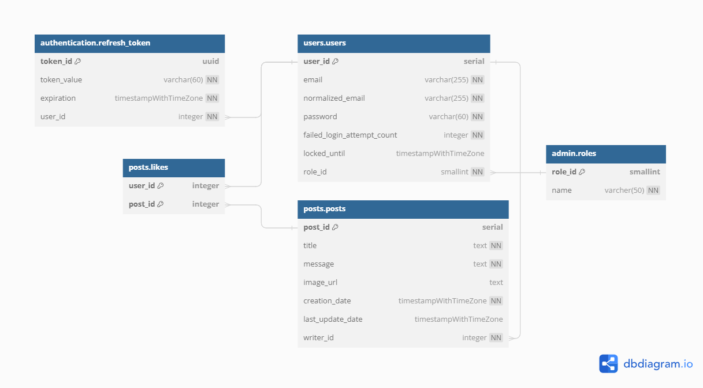

# Database structure for the Groupomania social network

## Installation

**Note**: In order to install the database, you need to install **[PostgreSQL](https://www.postgresql.org/)** first.

You will find in this folder two files:

-   **create.sql** containing the dump of the structure of the database;
-   **init.sql** containing some data for the database.

**For security reasons**, before going any further, we strongly recommand updating the **create.sql** file to personnalize the created roles and their passwords:

-   Change all occurences of `project_admin` to the role name you wish to use to own the database and have all the rights on it.
-   Change all occurences of `project_user` to the role name you wish to use to use the database and have limited rights on it.
-   Change all occurences of `admin_password` with a secure password for the _project_admin_ role.
-   Change all occurences of `user_password` with a secure password for the _project_user_ role.

You are free to choose any role, but _we suggest you create new ones_, to avoid granting privileges to other databases to these roles. If however you decide to reuse other roles, you may delete the `CREATE ROLE` statements corresponding to those roles.

**Note:** this can easily be done with a _find & replace_ functionnality in a text editor.

In the following instructions, _project_admin_ and _project_user_ will refer to the roles you choose.

### Install the database

To install the database, first execute:

```
psql -U superuser -d postgres -h localhost -f path/create.sql
```

-   `superuser` is the name of the role you want to use to connect to the database. This is not the _project_admin_ role. More informations bellow.
-   We use the **postgres** database since it should be present on your server, but you can use any database except _groupomania_.
-   Replace localhost with the address of your database if it is remote.
-   `path/create.sql` must be replaced by the path to the **create.sql** file.

This will execute the statements inside of the _create.sql_ dump.

These statements will first create the _groupomania_ database as well as the _project_admin_ and _project_user_ roles. To make sure these operations happen smoothly:

-   Connect with a superuser role, or any role with the `CREATEROLE` and `CREATEDB` privileges.
-   Delete the statements for the creation of the roles if you wish to reuse existing roles, althought we advise against it.
-   If the _groupomania_ database already exist, either drop the existing database, rename it or change the name of the new database.

**Note**: if you get an connexion error because the program is not asking for your password, try adding the `-W` option in the command line. This forces psql to ask you for your password. Beware, as using this argument will also force psql to ask you for the *project_admin*'s password you chose after creating both roles.

### Add data to the database

Once the structure is installed, you can add data to the tables with:

```
psql -U project_admin -d groupomania -h localhost -f path/init.sql
```

This time, you must connect to the new _groupomania_ database with the new _project_admin_ role. `path/init.sql` must be replaced by the path to **init.sql**. Don't forget to replace *localhost* with the address of your remote database!

For more informations on the `psql` command and all it's options, visit [the documentation](https://docs.postgresql.fr/10/app-psql.html).

**Note**: if you get an connexion error because the program is not asking for your password, try adding the `-W` option in the command line. This forces psql to ask you for your password.

## Structure

The tables are split into 4 schemas:

-   _admin_: containing all tables that the application, and thus the _project_user_, shouldn't update;
-   _authentication_: containing all tables related to the authentication mechanism;
-   _users_: containing all the users related tables;
-   _posts_: containing all the posts related tables.



### Roles table

This table contains the list of roles. It is part of the _admin_ schema.

By defaults, two roles are inserted:

-   _user_ with id _2_, and the default role for any user;
-   _admin_ with id _1_, and the superuser role.

**The application can access these data but shouldn't be able to update them.**

**Warning:** the _role_id_ field, which is the primary key, is not an auto-updated value. When inserting into the table, you have to give this field a value that respect the _unique_ and _not null_ constraints.

### Refresh_tokens table

This table contains all the refresh tokens that havent been manualy invalidated. It is part of the _authentication_ schema.

For security reasons, the _token_value_ field must only contain the encrypted value of the token, using an algorithm like _bcrypt_ or _Argon_.

Since the value is encrypted, the _token_id_ field can be used to identify the token, by storing the value in the token itself. Since the value needs to be unique and generated before the insertion, a UUID is used.

### Users table

This table contains informations about each user. It is part of the _users_ schema.

The _email_ fields checks that all the values are indeed unique and match an email regular expression.

The _password_ field must only contain encrypted values, using an algorithm like _bcrypt_ or _Argon_.

By default, each user will receive the _user_ role, of id 2. This field references the _roles.role_id_ field.

The fields _failed_login_attempt_count_ and _locked_until_ are used to protect the account from brute force attack. On each unsuccessful login attempt, the _failed_login_attempt_count_ should be incremented, and reset when the user finaly manages to log in. Using a trigger, the _locked_until_ field is automatically updated with _failed_login_attempt_count_, to match the lock time with the number of tries. A user must not log in if it's account is locked, i.e. if _locked_until_ is greater than the current date-time.

### Posts table

This table contains information about each post and is part of the _posts_ schema.

A post contains a _title_ and a _message_, as well as an optionnal _image_url_.

The post date of creation is stored in _creation_date_. By default, the date of the last update _last_update_date_ is null, and is updated at each update using a trigger.

A posts belongs to the user who wrote it. The _writer_id_ field references the _users.user_id_ field.

### Likes table

This table stores the likes, and is part of the _posts_ schema.

A like is simply a relation between one user and one post: if a user likes a post, then the relation is created; and if the user removes its like, then the relation is deleted.

To make sure that one precise user likes one precise post only once, the primary key, and thus the _unique_ constraint, contains the user/post couple.

Of course, the _user_id_ and _post_id_ fields respectively reference the _users.user_id_ and _posts.post_id_ fields.
